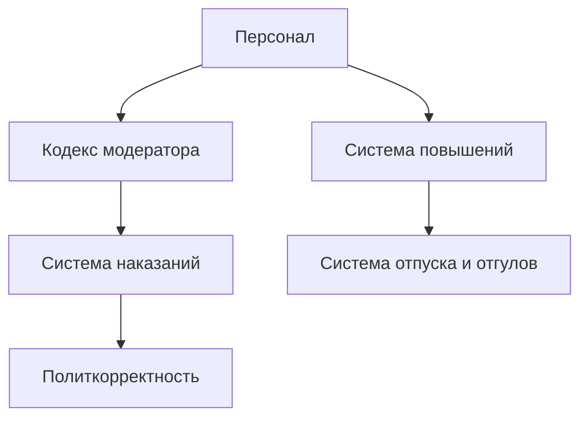

# 📚 Административная документация

## 🏆 Обзор системы модерации

## 🔍 Основные разделы:

### 👥 Управление персоналом
- [Должности и обязанности](/admin/positions) - иерархия и зоны ответственности
- [Система повышений](/admin/promotions) - критерии карьерного роста

### ⚖️ Регламенты
- [Кодекс модератора](/admin/rules) - стандарты работы
- [Система наказаний](/admin/punishments) - градация нарушений

### 📑 Рабочие процедуры
- [Система отпуска и отгулов](/admin/vacation) - порядок оформления
- [Политкорректность](/admin/politcorrectness) - нормы общения

> ⚠️ 404 Access Not Found - Кодекс модератора v1.0
