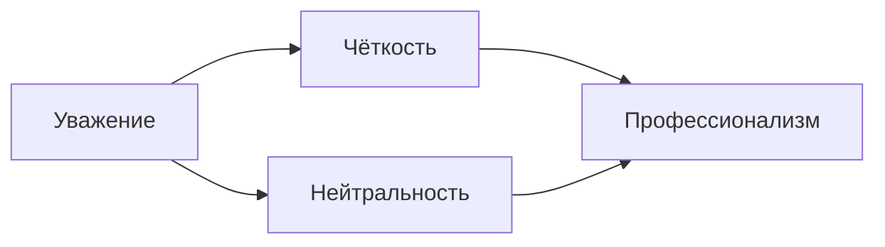

# 🌐 Политкорректность и профессиональное общение

## 📌 Основные принципы

## 🚫 Запрещённые действия
- 🔇 Оскорбления и переход на личности
- 🤬 Мат в публичных чатах
- 🔥 Публичные конфликты
- 🚷 Провокационный контент в профиле

## ✅ Рекомендации по общению
### 1. С игроками
- 👔 Обращение на "Вы" 
- 💬 Чёткие и вежливые ответы
- ⏳ Выдержка в конфликтных ситуациях
- 📨 Решение споров в приватных беседах

### 2. В команде
- 🤝 Уважение к коллегам
- 📊 Конструктивная критика
- 🔒 Обсуждение разногласий с руководителем
- 🎯 Совместное решение проблем

## 🌍 Политкорректность на практике
**Используйте:**
- Нейтральные формулировки
- Факты вместо субъективных оценок
- Уважительные обращения к каждому человеку

**Избегайте:**
- Политических/религиозных тем
- Стереотипов
- Дискриминационных выражений

## ⚠️ Последствия нарушений
- 1-е нарушение: Предупреждение
- 2-е нарушение: Временное отстранение
- Систематические нарушения: Исключение из команды

## 💡 Советы для новых сотрудников
1. Перед отправкой сообщения проверьте его тональность
2. В сомнительных ситуациях консультируйтесь со старшими
3. Используйте шаблонные ответы для частых вопросов
4. Всегда сохраняйте скриншоты спорных ситуаций

> ⚠️ 404 Access Not Found - Кодекс модератора v1.0
