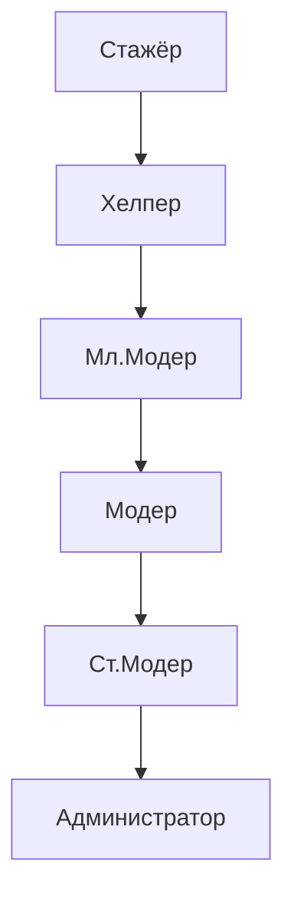

# 🚀 Система повышений персонала

## 📈 Карьерная лестница

## 1. 🎓 Стажёр → 💡 Хелпер
**Требования:**
- ✅ 2-4 недели испытательного срока
- 📚 Полное знание правил сервера
- 💬 50+ полезных ответов игрокам
- ⚠️ 0 дисциплинарных взысканий

**Кто повышает:** Модер/Ст.Модер

## 2. 💡 Хелпер → 🛡️ Мл.Модер
**Требования:**
- ⏳ 1-2 месяца в должности
- 📝 5+ успешных репортов
- 🧐 Участие в 3+ разборах
- 👍 Рекомендация от модератора

**Кто повышает:** Ст.Модер/Админ

## 3. 🛡️ Мл.Модер → 👮 Модер
**Требования:**
- ⏳ 2-3 месяца работы
- ⚖️ 30+ корректных наказаний
- 🛠️ Владение инструментами модерации
- 🤝 5+ сложных разборов

**Кто повышает:** Ст.Модер/Админ

## 4. 👮 Модер → 🔧 Ст.Модер
**Требования:**
- ⏳ 3-4 месяца в должности
- 📊 Ведение системных отчётов
- 🎓 Обучение 2+ модераторов
- 👥 Лидерские качества в команде

**Кто повышает:** Администратор

## 5. 🔧 Ст.Модер → 📌 Админ
**Требования:**
- ⏳ 4-6 месяцев работы
- 💻 Глубокое понимание работы сервера
- ✨ 2+ реализованных улучшения
- 🤝 Доверие владелеца / глав. администратора

**Кто повышает:** Владелец/Гл.Админ

## 🔔 Дополнительные условия
- ⚡ Возможность досрочного повышения за особые заслуги
- ⏳ 2 недели испытательного срока после повышения
- 🕒 Минимум 15-20 часов активности в неделю
- 👍 80%+ положительных отзывов от игроков
- 👥 Навыки командной работы и субординации

> ⚠️ 404 Access Not Found - Кодекс модератора v1.0
