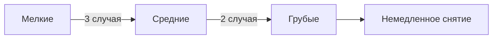
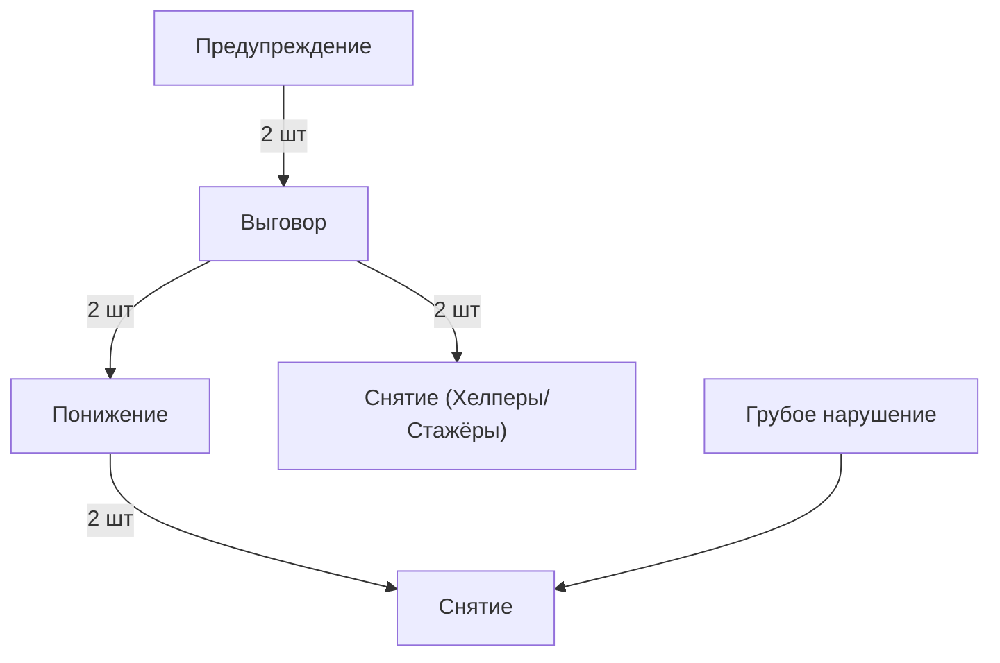

# ⚠️ Система наказаний для персонала

## 📊 Градация нарушений

## 🚦 Виды нарушений

### 🟢 Мелкие (устное предупреждение)
- 7+ дней неактивности без предупреждения
- Единичные ошибки в модерации
- Незначительные нарушения тона общения

### 🟡 Средние (выговор)
- Повторные ошибки в работе
- Систематическое невыполнение обязанностей
- Нарушения политкорректности

### 🔴 Грубые (снятие)
- Использование админ-прав в личных целях
- Читерство на сервере
- Умышленный вред проекту
- Разглашение конфиденциальной информации

## ⚖️ Система взысканий

## 📅 Сроки действия
| Наказание | Длительность | Условия снятия |
|-----------|--------------|----------------|
| Предупреждение | 14 дней | Безупречная работа |
| Выговор | 30 дней | Успешное исправление |
| Понижение | 60 дней | Положительная оценка |

## 👨⚖️ Кто наказывает
- **Предупреждения**: Ст.Модер и выше
- **Выговоры**: Администратор и выше
- **Понижения/Снятия**: Владелец + подтверждение 2х Админов

## 🔄 Процедура обжалования
1. Подача апелляции в течение 72 часов
2. Рассмотрение вышестоящим руководством
3. Максимальный срок рассмотрения - 5 дней
4. Окончательное решение пересмотру не подлежит

## 💡 Важные примечания
- 3 мелких нарушения = 1 среднее
- 2 средних нарушения = 1 грубое
- Нарушения политкорректности караются строже
- Особые заслуги могут смягчить наказание

> ⚠️ 404 Access Not Found - Кодекс модератора v1.0
