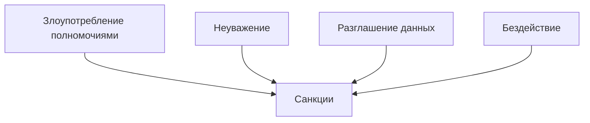

# ⚖️ Кодекс модератора

## 🚫 Категорические запреты

### 🔴 Что нельзя делать
1. **🚷 Злоупотребление властью**
   - Использовать админ-команды в личных целях
   - Давать себе/друзьям преимущества

2. **🙈 Игнорирование нарушений**
   - Пропускать явные нарушения правил
   - Оставлять жалобы без ответа

3. **🤬 Грубое поведение**
   - Оскорбления игроков/коллег
   - Пренебрежительный тон

4. **🔓 Утечка информации**
   - Публикация личных данных
   - Разглашение служебных обсуждений

## ✅ Обязанности модератора

### 🛡️ Основные правила
- 📜 Чёткое знание всех правил сервера
- ⚖️ Объективность в принятии решений
- 🕵️ Проверка доказательств перед наказанием
- 📝 Ведение логов всех действий

### 🔄 Процедуры модерации
1. **Получение жалобы**:
   - Фиксация времени и обстоятельств
   - Сбор доказательств (скриншоты, логи)

2. **Принятие решения**:
   - Сверка с правилами сервера
   - Консультация с старшими при сомнениях

3. **Применение санкций**:
   - Чёткое объяснение причины наказания
   - Фиксация в системе отчетности

## 💡 Советы для эффективной работы
- Всегда сохраняйте скриншоты действий
- Используйте шаблонные ответы для частых ситуаций
- При конфликтах - обращайтесь к старшим модераторам
- Регулярно обновляйте знания правил сервера

> ℹ️ В спорных ситуациях окончательное решение принимает администрация проекта. Любые действия должны соответствовать установленным процедурам.
