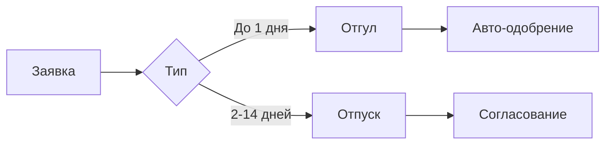
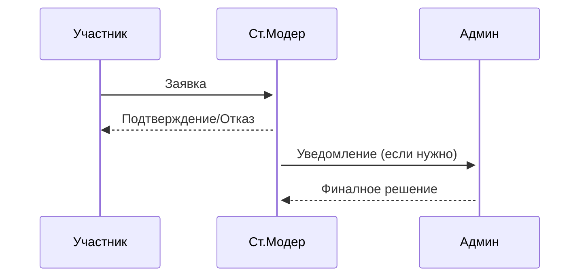

# 📅 Система отпуска и отгулов

## 📌 Общие правила


## 🕒 Отгул (до 24 часов)
### 📌 Условия
- ✅ **Лимит:** 3 раза в месяц
- ⏳ **Минимальный срок подачи:** 24 часа
- 📅 **Максимальная длительность:** 1 рабочий день

### 📝 Форма заявки
```plaintext
[Отгул]
Дата: ДД.ММ
Время: ЧЧ:ММ-ЧЧ:ММ (или "полный день")
Причина: (необязательно)
```

## 🌴 Отпуск (2-14 дней)
### 📌 Условия
- 🔄 **Лимит:** 1 раз в 3 месяца
- ⏳ **Минимальный срок подачи:** 3 рабочих дня
- 👥 **Необходимо назначить замену**
- 🚨 **Форс-мажор:** до 30 дней (особые случаи)

### 🗂 Порядок согласования
| Должность | Кто согласовывает |
|-----------|-------------------|
| Модератор | Ст.Модер |
| Хелпер | Ст.Модер |
| Администратор | Владелец |

### 📝 Форма заявки
```plaintext
[Отпуск]
Период: ДД.ММ - ДД.ММ
Замена: @никнейм
Причина: (развернуто)
Контакты на время отпуска: ...
```

## ⚠️ Важные примечания
1. Все заявки дублируются в #отчетность
2. Несвоевременные уведомления считаются нарушением
3. Злоупотребления ведут к санкциям
4. В период отпуска доступ к админ-правам приостанавливается

## 🔄 Процесс согласования


## 🚨 Чрезвычайные ситуации
- Внезапные болезни: уведомить в течение 12 часов
- Технические проблемы: скриншот в подтверждение
- Семейные обстоятельства: краткое объяснение


> ⚠️ 404 Access Not Found - Кодекс модератора v1.0
